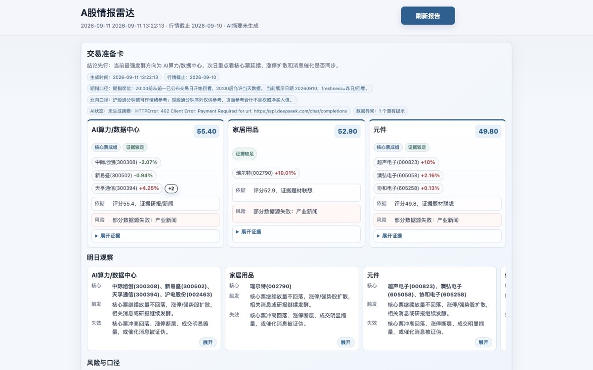

# A股情报雷达

`Adailynews` 是一个面向移动端的 A 股每日情报面板。项目通过 GitHub Actions 自动采集市场热点、涨停结构、板块资金、股指期货席位、研报和重点产业消息，并发布到 GitHub Pages。

维护者：[yuuu96](https://github.com/yuuu96)

[打开在线版](https://yuuu96.github.io/Adailynews/) | [查看运行说明](./DAILY_INTEL.md) | [查看更新记录](./CHANGELOG.md)



## 项目能力

页面顶部提供“交易准备卡”，先展示最强方向、明日观察、风险提示和关键数据口径。其下保留九个情报模块：

1. **最强发酵方向**：结合题材热度、涨停行业集中度和一字板结构识别当日主线。
2. **板块异动雷达**：按资金连续性、涨停结构、价格强度和成交放大观察板块变化。
3. **热点上游材料雷达**：跟踪碳酸锂及半导体材料的紧缺线索、相关 A 股和产业消息。
4. **材料突发消息**：聚合涨价、断供、扩产和供需变化等事件。
5. **期指重点席位多空**：汇总中信系及其他重点机构在 IF、IC、IH、IM 的持仓方向。
6. **主题研报精华**：展示中金每日研报、指定分析师跟踪、近三天研报和海外机构观点线索。
7. **重点公司/产业消息**：关注宁德时代、美股科技、韩股科技、半导体上游、亿纬锂能及美国宏观与美联储。
8. **产业链 A股映射**：展示重点产业方向对应股票的价格、涨跌幅、成交额、市值和量比。
9. **数据源状态与口径**：公开数据来源、日期、置信度、降级路径和异常提示。

## 数据与口径

| 数据类型 | 主要来源 | 页面口径 |
| --- | --- | --- |
| A 股行情 | 腾讯财经 | 优先使用已收盘交易日行情，展示行情日期和来源 |
| 热点与涨停 | 同花顺、东方财富 | 题材词频、涨停池、行业集中度和一字板 |
| 板块资金 | 东方财富 | 行业与概念板块的当日、5 日或 10 日资金数据 |
| 财经快讯 | 财联社、东方财富、上海金属网 | 聚合后按关注主题和时间窗口筛选 |
| 公司公告 | 巨潮资讯 | 重点公司的最新公告和业绩信息 |
| 机构研报 | 东方财富研报接口及公开资讯线索 | 链接或 PDF 均可，区分正式研报和观点线索 |
| 股指期货席位 | 中金所公开排名，经 akshare 读取 | 北京时间 20:00 前从前一日开始回看，20:00 后允许使用当天已公布数据 |

关键模块会显示 `实时`、`昨日`、`回看`、`缺失` 或 `低置信` 等标签。单一数据源失败不会中断整份报告，页面会保留失败原因和实际使用的降级来源。

## 自动更新

GitHub Actions 使用 UTC cron，当前对应的北京时间计划为：

| 日期 | 自动生成时间 |
| --- | --- |
| 周一至周五 | 08:56、18:58 |
| 周六 | 不自动生成 |
| 周日 | 18:58 |

GitHub Actions 的定时任务可能比设定时间延迟数分钟。页面上的“刷新报告”只会绕过缓存并重新读取最近一次生成结果；真正重新采集数据需要等待定时任务，或在仓库的 Actions 页面手动运行 `Daily A-share Intelligence`。

## DeepSeek 摘要

AI 摘要是可选能力。未配置 API Key 时，采集、规则摘要和九个模块仍会正常生成。

云端自动摘要推荐在仓库 `Settings -> Secrets and variables -> Actions` 中添加：

```text
DEEPSEEK_API_KEY
```

模型默认使用 `deepseek-v4-pro`。在线页面也允许临时输入 Key，对已加载的数据重新生成摘要；Key 仅保存在当前浏览器的 `localStorage`，不会写入仓库。

## 本地运行

```bash
git clone https://github.com/yuuu96/Adailynews.git
cd Adailynews
python3 -m venv .venv
source .venv/bin/activate
pip install requests pandas akshare mootdx
python3 intel_web.py
```

电脑浏览器打开 `http://127.0.0.1:8765`。同一局域网内需要手机访问时运行：

```bash
python3 intel_web.py --host 0.0.0.0 --port 8765
```

然后在手机浏览器打开 `http://电脑局域网IP:8765`。本地模式支持“一键生成”和实时进度；GitHub Pages 是静态页面，不依赖个人电脑在线。

## 自定义关注内容

公开部署使用仓库配置文件 [`config/intel_config.json`](./config/intel_config.json)。可在其中调整：

- 产业链股票观察列表
- 重点公司和新闻关键词
- 美股、韩股科技及宏观事件组
- 指定券商分析师
- 交易准备卡的展示数量

修改配置并推送后，下次 GitHub Actions 生成报告时统一生效。

## 主要文件

| 文件 | 用途 |
| --- | --- |
| `daily_intel.py` | 数据采集、清洗、评分、报告生成与 DeepSeek 摘要 |
| `intel_web.py` | 本地 PWA 服务及一键生成接口 |
| `build_static_site.py` | 将最新报告构建为 GitHub Pages 静态站点 |
| `web/` | 移动端页面、渲染逻辑、样式和 Service Worker |
| `config/intel_config.json` | 关注股票、主题、公司和分析师配置 |
| `.github/workflows/daily-intel.yml` | 定时采集和 GitHub Pages 部署流程 |

## 风险声明

本项目聚合公开数据并提供研究线索，不保证数据源持续可用，也不构成投资建议。行情、席位、新闻和研报均应结合原始来源复核。股市有风险，投资需谨慎。

## 致谢与许可

本项目的数据获取能力部分基于 Simon Lin 的开源项目 [`a-stock-data`](https://github.com/simonlin1212/a-stock-data)，并在此基础上开发了独立的采集编排、情报模块、历史连续性、数据可信度标注、PWA 页面和 GitHub Actions 发布流程。

项目保留原项目的 [Apache License 2.0](./LICENSE) 许可和版权声明。`AGENTS.md` 与 `SKILL.md` 为底层数据工具说明，保留原作者署名；本仓库的 `Adailynews` 应用由 [yuuu96](https://github.com/yuuu96) 维护。
